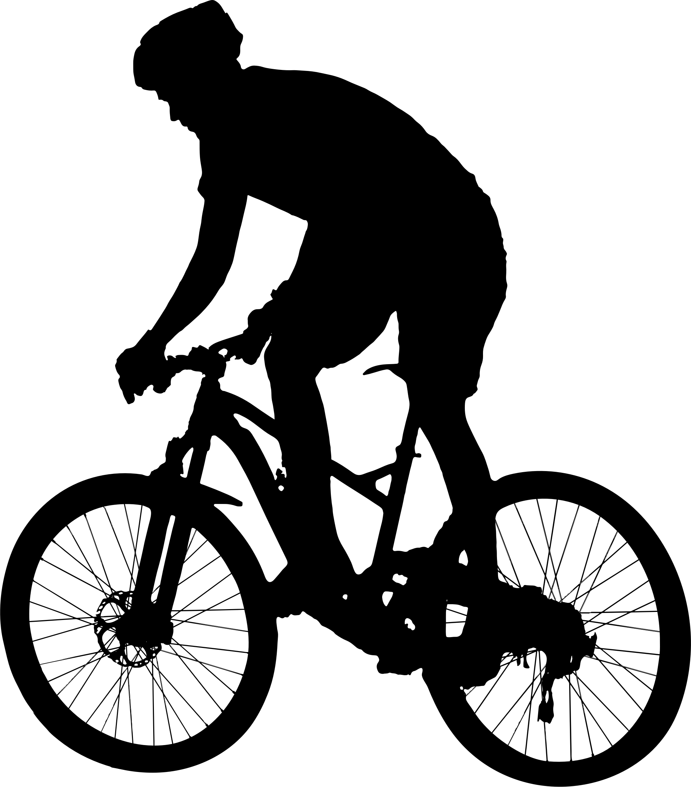
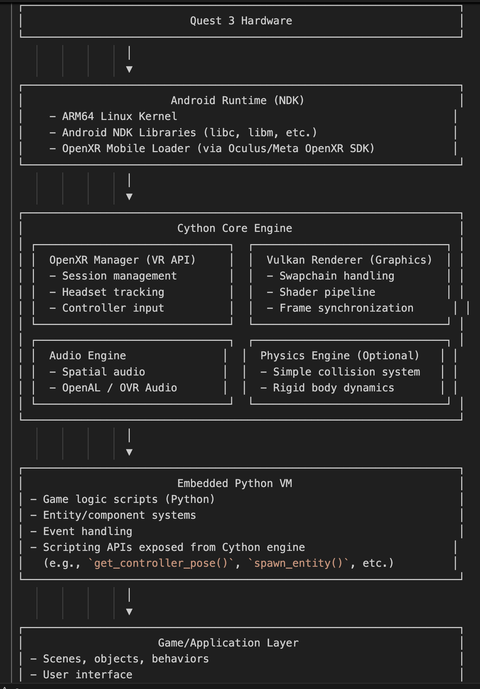

# Charvak

  // Replace with the actual path and filename

Charvak , the gaming engine. Open source engine  written to make AAA games in Cython.
Long term goal - Write in game logic in Python , and build for all platforms (VR , Windows, linux , mac , android , ios , web ,etc..)

 

 Date - 6 may 2024

 Lets integrate raylib and a physics engine  , which can be compiled to webassembly